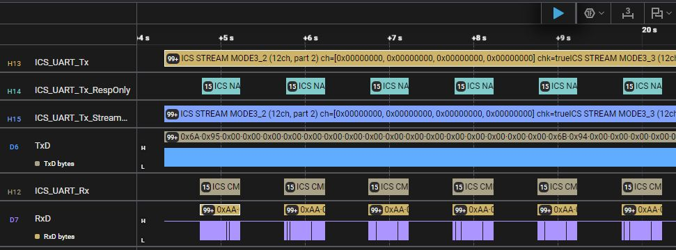
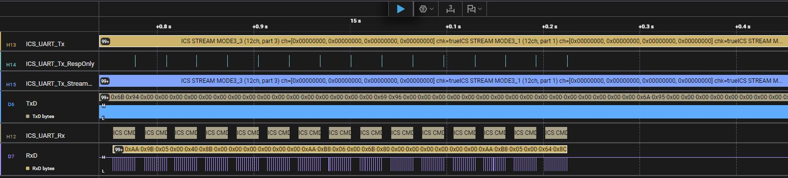
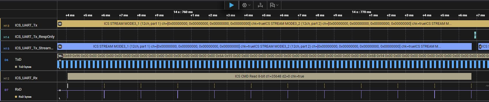
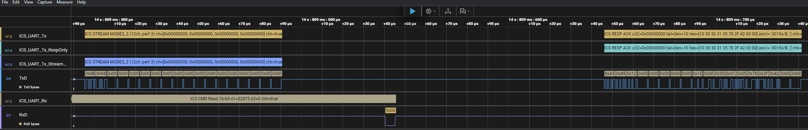

# ICS UART protocol High-Level Analyzer for the Saleae Logic

Decodes ICS command (host→target), response (target→host), and streaming scope packets (H_CODE_MODE*) on the UART used by DeskTopLab ICS/ICS++.

## Usage
- In Logic, add the UART protocol decoder (8-N-1, matching your ICS baud).
- Add one or more of the following HLAs on top of the UART decoder:
  - `ICS_UART_Rx`: host→target commands.
  - `ICS_UART_Tx`: target→host responses + streaming.
  - `ICS_UART_Tx_RespOnly`: target→host responses only (no stream packets).
  - `ICS_UART_Tx_StreamOnly`: target→host stream packets only.

## What it shows
- Command frames (0xAA sync, 12 bytes): command name, data1/data2, checksum validity.
- Responses (18 bytes): ACK/NAK, checksum validity; ACK payload decoded as u32/u16 plus optional tail; NAK error code.
- Scope streaming packets: H_CODE_MODE* headers decoded with channel samples (if using a *Stream* variant).

## Screenshots (pics/)

Full view with RX+TX analyzers stacked on one UART; shows mixed commands, responses, and stream packets.

Stream-only analyzer highlighting a burst of MODE stream packets.

Time-separated command/response exchange; shows ACK payload decoding.

Interleaved stream burst followed by a command completion and its response, illustrating coexistence.

## Versions
1.0.0 Initial release
